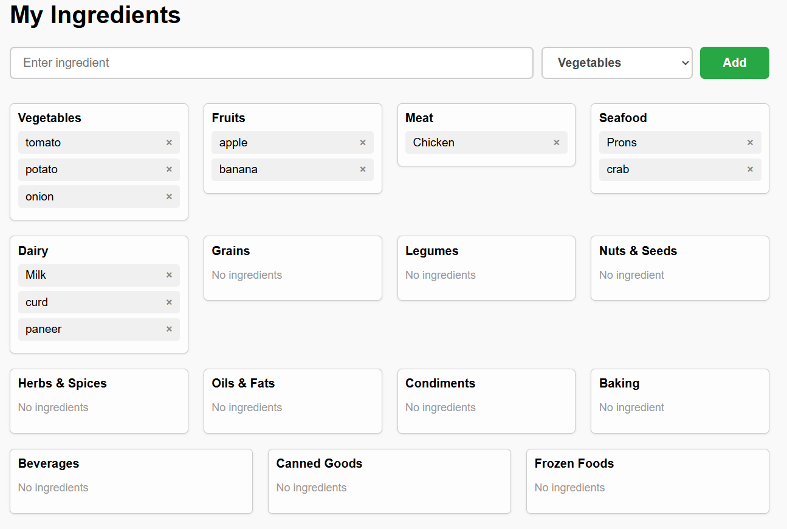

# 🥦 Grocery Ingredient App

A simple JavaScript web app to manage grocery ingredients by category. You can add and remove items, and the data is saved in localStorage so it stays even after refreshing the page.

---

## ✨ Features

- ✅ Add ingredients to categories (e.g., Vegetables, Fruits, Spices)
- ❌ Remove ingredients individually
- 💾 Data is saved in `localStorage`
- 🔄 Automatically reloads data on page load
- 💡 Built using plain HTML, CSS, and JavaScript

---

## 📸 Screenshots

 <!-- Replace with actual screenshot path -->

---

## 🚀 Getting Started

### 1. Clone the repo

```bash
git clone https://github.com/your-username/grocery-ingredient-app.git


📁 grocery-ingredient-app/
│
├── index.html
├── style.css
└── script.js

📂 Folder Structure
project-folder/
├── index.html       # Main HTML file
├── style.css        # App styling
└── script.js        # Core JavaScript logic

